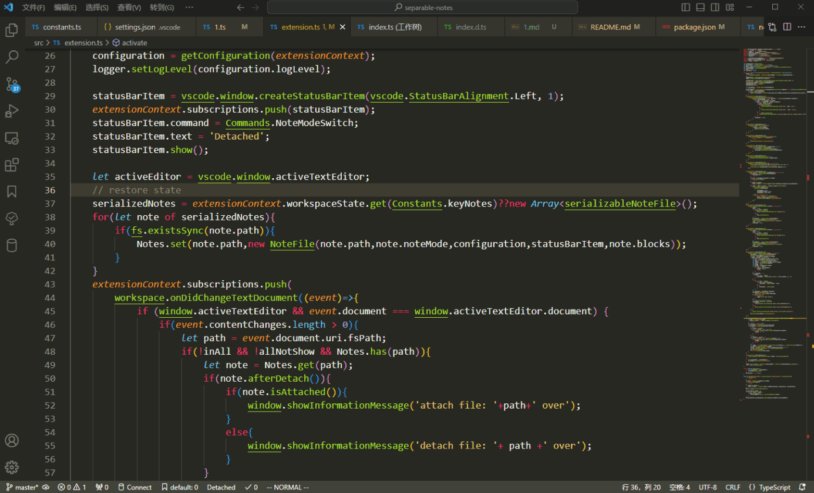

**Read this in other languages: [English](README.md), [中文](README_zh.md).**

# separable-notes 
separable notes is a VSCode extension that can manage your inline code note, make your note separable.

It can be applied to scenarios sucmh as:
* keep your note private and not committing to the repository that is maintained by many people.
* outline your code and organize you code note in standalone markdown file.
* reorganize your note in markdown file(by define @id and @refid, can easily imbed code in arbitrary markdown file)



It is tested on windows 10.

### Usage
After installing separable notes, you will be able to manage your inline code note.

#### Quick Commands:
##### global commands
* separableNotes detachAll:
   * detach all notes in this workspace 
* separableNotes attachAll
  * attach all notes in this workspace
* separableNotes syncMdWithSrc
  * export notes in markdown file(in .vscode/sepNotes.md)
  * in generated markdown file, you can go to src file by click ctrl+(left button)
##### menu commands
* separableNotes NoteIt
  * Add Comment or Remove Comment
* separableNotes openSepNotes
  * for quick open sepNotes file

##### about src file and sepNotes file sync
* when you edit src file, content can be synced with sepNotes file and vice versa.

#### Configuration
**noteId** can be configurated to identify the line which should be detached(default is SEPNOTES).
 \
if you change this, you should also change the configuration for todo-tree or other plugins.

#### Recommended configuration for todo-tree:
* add tags and  customHighlight for new noteId
```json
    "todo-tree.general.tags": [
        "SEPNOTES"
    ],
    "todo-tree.highlights.customHighlight": {
        "SEPNOTES":{
            "icon": "note",
            "foreground": "#409EFF",
            "gutterIcon": true,
            "type": "tag"
        }
    },
    "todo-tree.tree.showCountsInTree": true,
    "todo-tree.regex.regexCaseSensitive": false,
    "todo-tree.general.statusBar": "current file",
```

### Prerequisites
[TODO Tree](https://marketplace.visualstudio.com/items?itemName=Gruntfuggly.todo-tree) or other tag Highlighting vscode plugin.


### Installation
* From VS Code by searching separable notes
* From [marketplace](https://marketplace.visualstudio.com/items?itemName=hurly.separable-notes)
### ChageLog

#### 0.1.1
* sync notes with standalone markdown file for summarize and easy to view  ``in sepNotes.md``
  * this file also record information about file attach status and sync time
  * can easily open this file by clicking on the menu
  * 
* add @id and @refid to mbed code in arbitrary markdown file

#### 0.1.0
* First working version


### Feedback
* If you have any questions, feel free to ask and I'll get back to you at the weekend.


### TODO
* 重新匹配代码和笔记

Please star it if you like it, Thanks.

Thanks to [todo-tree](https://github.com/Gruntfuggly/todo-tree)