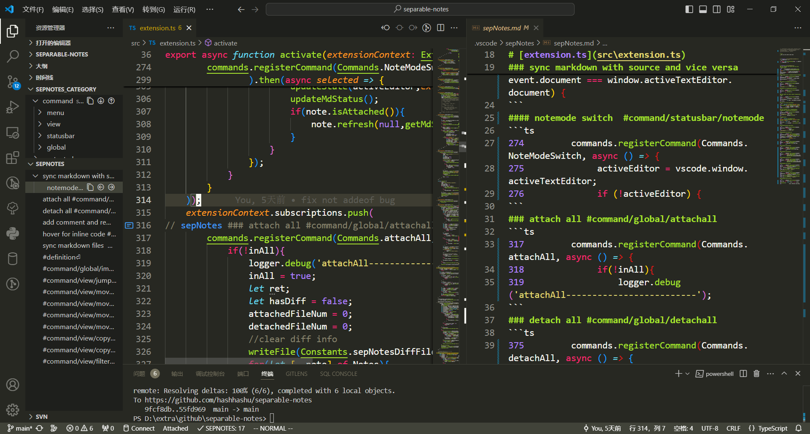

**其他语言版本: [English](README.md), [中文](README_ZH.md).**  
**:exclamation:使用前请先做一些测试，代码和笔记请及时备份(也可以通过vscode的时间线功能查看恢复内容)**

可以在[知乎](https://zhuanlan.zhihu.com/p/699890862)上查看详细的使用说明
# separable-notes 
separable notes 是一个 VSCode 插件，它可以管理你的内联代码笔记，并可以使你的笔记可分离

它可以应用于以下场景，例如：
* 保持你的笔记私密性，不将其提交给由多人维护的存储库(可以方便地合并或分离)。
* 梳理你的代码，并将你的代码笔记组织到独立的 Markdown 文件中(`sepNotes.md`)(以文件目录方式),并且对该文件的修改可以同步到源文件中。
* 可以给笔记内容贴上标签，并支持多级标签，贴上标签的内容会以多级标题的方式重新组织(通过定义#xxx/abc格式，结果显示在`sepNotes_category.md`)(可以在侧边栏的资源管理器中看到大纲内容)



在 Windows 10 上经过测试。 

### 用法
安装 separable notes 插件后，您将能够管理您的内联代码笔记。

#### 快捷命令:
##### 全局命令
* separableNotes detachAll:
   * 将此工作区中的所有笔记分离
* separableNotes attachAll
  * 将此工作区中的所有笔记附加
* separableNotes syncMdWithSrc
  * 将笔记导出到 Markdown 文件（位于 `.vscode/sepNotes.md`）
  * 将笔记以类别的方式重新组织，导出到Markdown文件(位于`sepNotes_category.md`)
  * 在生成的 Markdown 文件中，你可以通过按下 Ctrl 键和（鼠标左键）跳转到源文件
* separableNotes.importNotes
  * 将笔记从文件`sepNotes.md`导入到代码中，原来的笔记会被替换

##### 菜单命令
* separableNotes NoteIt
  * 添加注释 或 取消注释
* separableNotes openSepNotes
  * 快速打开 sepNotes 文件
* separableNotes.syncPos
  * 根据源文件同步 `sepNotes.md`文件的位置 或者 根据`sepNotes.md`同步源文件(两个文件都需要可见)

##### 关于源文件和 sepNotes 文件的同步
* 当你编辑源文件时，内容可以与 sepNotes 文件同步，反之亦然

#### 配置
**noteId** 可以被配置用来标识应该被分离的行(默认是 SEPNOTES).
 \
如果你更改了这个设置，你也应该更改 todo-tree 或其他插件的配置。

### 安装
* 在vscode 插件中搜索separable notes
* 从[应用商店](https://marketplace.visualstudio.com/items?itemName=hurly.separable-notes)

### 搭配使用
[TODO Tree](https://marketplace.visualstudio.com/items?itemName=Gruntfuggly.todo-tree) 或者其他 VSCode 插件用于标签高亮
#### todo-tree 的推荐配置如下：
* 为新的 noteId 添加标签和自定义高亮：
```json
    "todo-tree.general.tags": [
        "SEPNOTES"
    ],
    "todo-tree.highlights.customHighlight": {
        "SEPNOTES":{
            "icon": "note",
            "foreground": "#409EFF",
            "gutterIcon": true,
            "type": "tag"
        }
    },
    "todo-tree.tree.showCountsInTree": true,
    "todo-tree.regex.regexCaseSensitive": false,
    "todo-tree.general.statusBar": "current file",
```


### 变更日志
#### 0.1.7
* add outline view for `sepNotes.md` in explorer view 
* command `separableNotes.syncPos` is abandon and cursor response is added instead
* add follow pos for outline view of `sepNotes.md`
* add outline edit for view of `sepNotes.md`(move left/right)
* outline for `sepNotes.md` can be adjusted by drag and drop
* outline order for `sepNotes_category` can be adjusted by drag and drop
* optimize cursor response

#### 0.1.6
* relative path is used instead of original absolute path to make it more portable
* can add description about tag in `sepNotes_category.md`
* fix bug about tag lost in `sepNotes_category.md`
* fix bug when new added node is not leaf node
* fix bug when syncMdWithSrc cause irregular changes in `sepNotes_category.md`
* add outline view for `sepNotes_category.md` in explorer view
* order can be adjusted via tree view in the sidebar view and original order way is abandoned
#### 0.1.5
* attach action is not needed anymore when adding first note 
* handle situation when src file cannot write
* `sepNotes.md` can jump to src file in detach mode 
* `sepNotes_category.md` now support edit and changes will also sync with other files
* can use `@order` to sort note in `sepNotes_category.md` 
* `separableNotes.syncPos` now support `sepNotes_category.md`(from `sepNotes_category.md` to src file)
* modify edit sync in  `sepNotes_category.md` and `sepNotes.md`
* `@order`support decimal number(such as `@order(1.2)`)
* remove `**s**` to reorganizing note in category and add **netsted tags** as `#s/a` to categorize 
* add `$` for note outliner `###` in `sepNotes_category.md` to avoid conflict
* add warn when edit `sepNotes.md` or `sepNotes_category.md` and src file is not matched
* add `syncMdWithSrc` command into menu command and tag identify optimize

#### 0.1.4
* refresh `sepNotes.md` after attach if line number diffs(note refresh while not match)
* add quick open for other file(`sepNotes_diff.md` `sepNotes_category.md`)
* add support for reorganizing note in category(shown in `sepNotes_category.md`) 
* fix sync bug(sync src file with `sepNotes.md`)
* save needrefresh state
* `separableNotes syncMdWithSrc` Commands now can sync `sepNotes_category.md` with src file
* add `separableNotes.importNotes` to import notes from `sepNotes.md` into code
* backup `sepNotes.md` before refresh content(backup file is `sepNotes _bak.md`)
* change root path to `.vscode/sepNotes/`
* limit file sync speed to avoid typing delay 
* add hint when note position is not appropriate(code below note is important when rematch is needed)
* add `separableNotes.syncPos` to sync `sepNotes.md` pos with src file and vice versa(tow file need to be visible)
* fix save state bug(`e.toJSON is not a function`)

#### 0.1.3
* can add user defined content in the begin of ``in sepNotes.md``
* fix the bug that (cannot adjust note pos when attach)
* remove src and markdown file alignment

#### 0.1.2
* adjust note line when attach file(file may changed in detach status)

#### 0.1.1
* sync notes with standalone markdown file for summarize and easy to view  ``in sepNotes.md``
  * this file also record information about file attach status and sync time
  * can easily open this file by clicking on the menu
  * 
* add @id and @refid to mbed code in arbitrary markdown file

#### 0.1.0
* First working version


### 反馈
* 如果你有任何问题，请随时提问，我会在周末回复你。


### TODO
* 重新匹配代码和笔记
* sepNotes文件开头有一块用于随意记录的区域
* 做一个匹配的事情
* 加个命令用于显示sepnotes文件的位置
* 检测当前是否是比较合适的位置

如果你喜欢的话，请给它点个星 :star:，谢谢。

感谢 [todo-tree](https://github.com/Gruntfuggly/todo-tree)